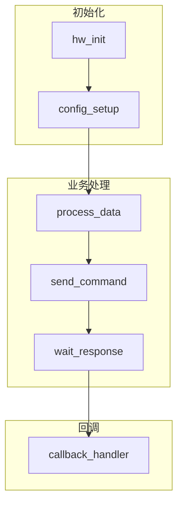
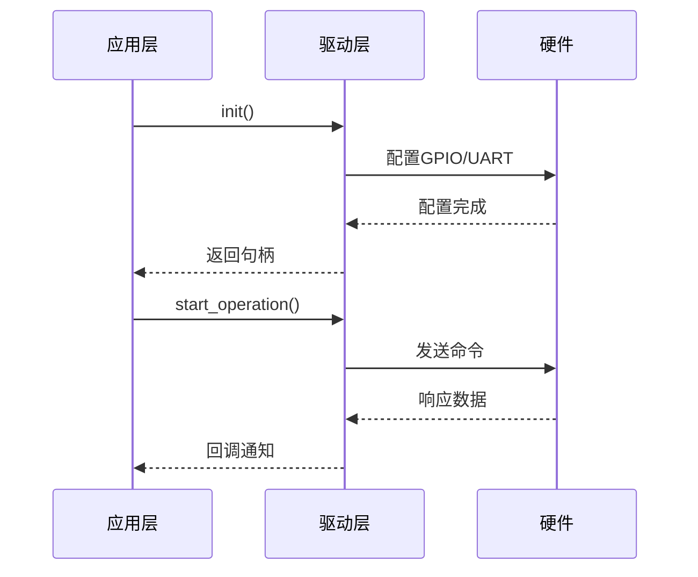

# Phase 4 实施计划 - 设计文档生成

> 版本: v1.0
> 日期: 2026-04-08
> 状态: 🚧 进行中

---

## 一、Phase 4 目标

在 Phase 1-3 基础上，扩展生成设计文档功能：
1. **架构概述** - 模块整体架构描述
2. **模块关系图** - 组件间的依赖关系
3. **数据流图** - 数据在各模块间的流动
4. **时序图** - 主要接口调用流程
5. **设计决策** - 关键设计说明

---

## 二、设计文档模板

```markdown
# {模块名称} 设计文档

## 1. 概述
- 模块定位
- 核心功能
- 适用场景

## 2. 架构设计
### 2.1 整体架构
[架构图]

### 2.2 模块划分
- 初始化模块
- 业务处理模块
- 数据管理模块
- 回调处理模块

## 3. 模块关系图
[依赖关系图]

## 4. 数据流图
[数据流向图]

## 5. 核心流程
### 5.1 初始化流程
[时序图]

### 5.2 业务处理流程
[时序图]

## 6. 接口设计
### 6.1 公开接口
### 6.2 回调接口
### 6.3 内部接口

## 7. 数据结构设计
### 7.1 核心数据结构
### 7.2 配置数据结构
### 7.3 状态数据结构

## 8. 设计决策
- 关键技术选择
- 限制与约束
- 扩展点设计

## 9. 移植指南
- 硬件依赖
- 平台适配
- 配置说明
```

---

## 三、实现方案

### 3.1 文件结构

```
agent/
├── generator/
│   ├── md_generator.py        # API 文档生成器
│   └── design_generator.py    # 设计文档生成器 (新增)
│
├── analyzer/                   # 代码分析模块 (新增)
│   ├── __init__.py
│   ├── architecture.py         # 架构分析
│   ├── dependency.py           # 依赖关系分析
│   ├── dataflow.py             # 数据流分析
│   └── sequence.py             # 调用序列分析
│
└── llm/
    └── design_desc_generator.py  # 设计描述生成 (新增)
```

### 3.2 核心模块

#### 3.2.1 架构分析器 (ArchitectureAnalyzer)

```python
class ArchitectureAnalyzer:
    """分析代码架构"""
    
    def analyze(self, ir: IR) -> ArchitectureInfo:
        """返回架构信息"""
        return ArchitectureInfo(
            module_name=...,
            module_purpose=...,
            components=[...],  # 组件列表
            layers=[...],      # 层次划分
        )
```

#### 3.2.2 依赖关系分析器 (DependencyAnalyzer)

```python
class DependencyAnalyzer:
    """分析模块依赖关系"""
    
    def analyze(self, ir: IR) -> DependencyGraph:
        """返回依赖图"""
        return DependencyGraph(
            nodes=[...],  # 模块/函数节点
            edges=[...],  # 依赖关系边
        )
```

#### 3.2.3 数据流分析器 (DataflowAnalyzer)

```python
class DataflowAnalyzer:
    """分析数据流向"""
    
    def analyze(self, ir: IR) -> DataflowInfo:
        """返回数据流信息"""
        return DataflowInfo(
            inputs=[...],    # 输入数据源
            outputs=[...],   # 输出数据
            transforms=[...], # 数据转换
        )
```

#### 3.2.4 设计文档生成器 (DesignGenerator)

```python
class DesignGenerator:
    """生成设计文档"""
    
    def generate(self, ir: IR, config: Config) -> str:
        """生成设计文档 Markdown"""
        # 1. 分析架构
        arch = self.arch_analyzer.analyze(ir)
        
        # 2. 分析依赖
        deps = self.dep_analyzer.analyze(ir)
        
        # 3. 分析数据流
        flow = self.flow_analyzer.analyze(ir)
        
        # 4. 生成文档
        return self._render_template(arch, deps, flow)
```

---

## 四、图表生成方案

使用 Mermaid 语法生成图表，Markdown 原生支持：

### 4.1 架构图



### 4.2 时序图



### 4.3 数据流图


---

## 五、实现任务

### 5.1 任务清单

- [x] 创建 Phase 4 实施计划文档
- [ ] 创建 analyzer 模块目录结构
- [ ] 实现 ArchitectureAnalyzer
- [ ] 实现 DependencyAnalyzer
- [ ] 实现 DataflowAnalyzer
- [ ] 实现 SequenceAnalyzer
- [ ] 实现 DesignGenerator
- [ ] 集成到主流程
- [ ] 添加命令行参数 `--design`
- [ ] 测试验证

---

## 六、版本历史

| 版本 | 日期 | 变更说明 |
|------|------|----------|
| v1.0 | 2026-04-08 | Phase 4 计划创建 |
